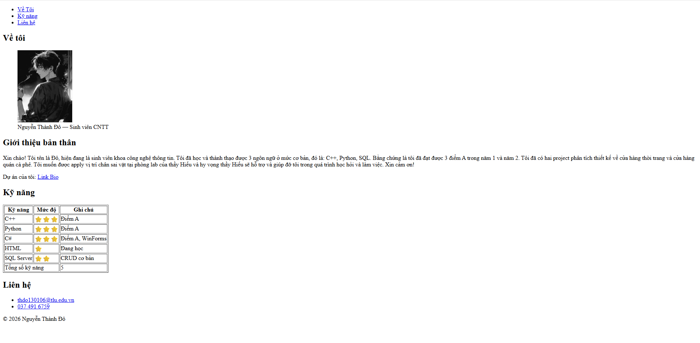
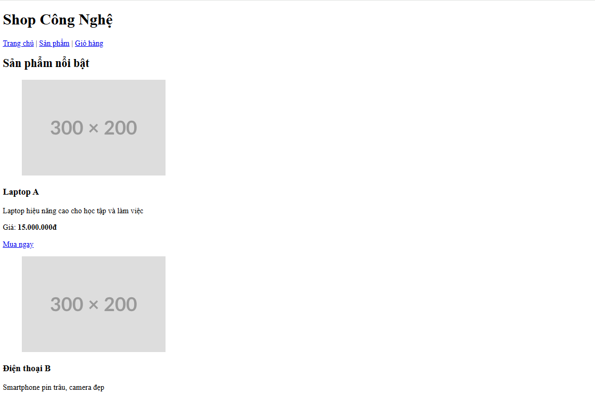
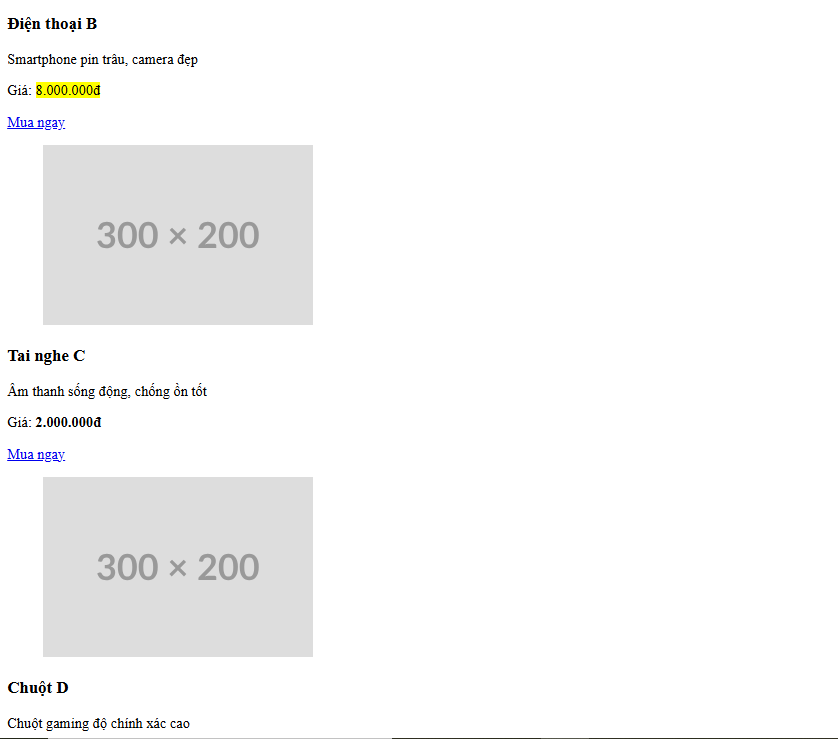
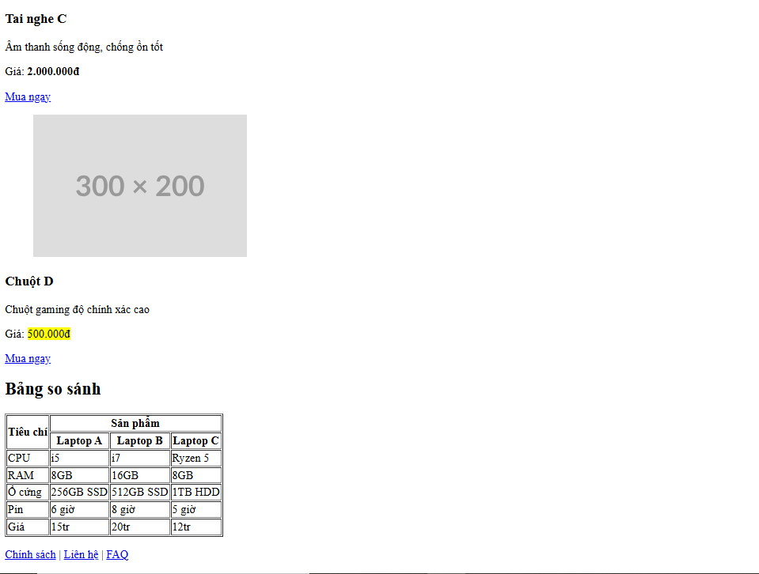
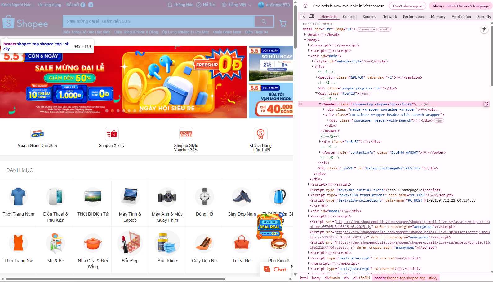
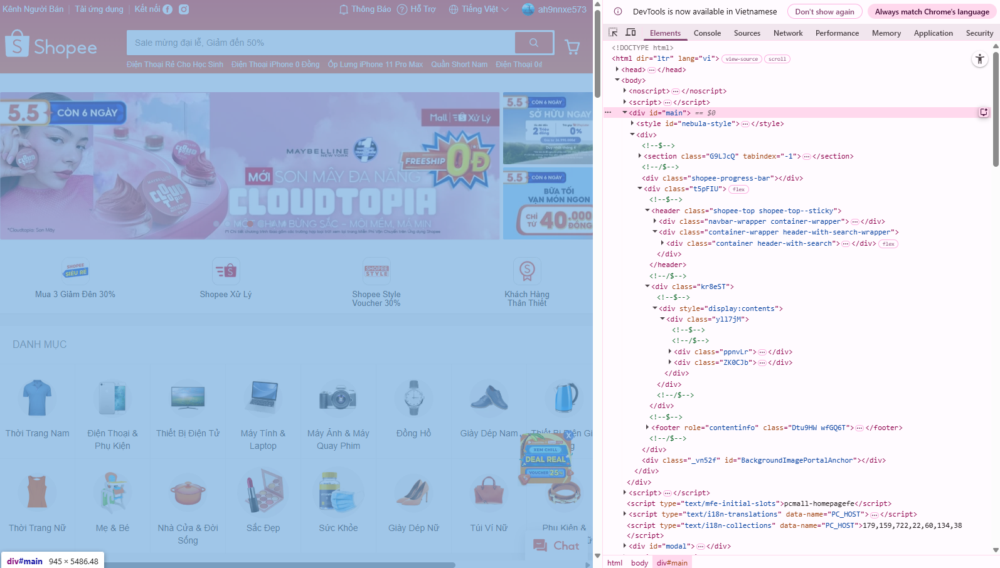
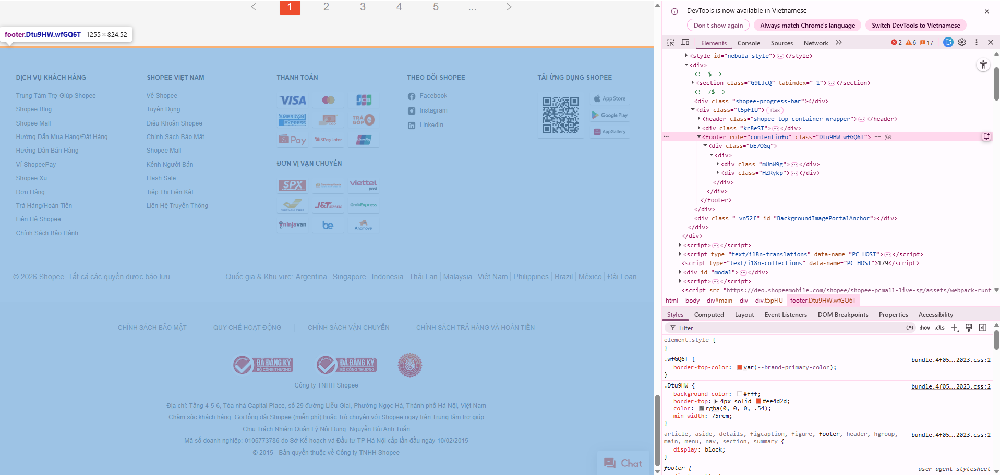
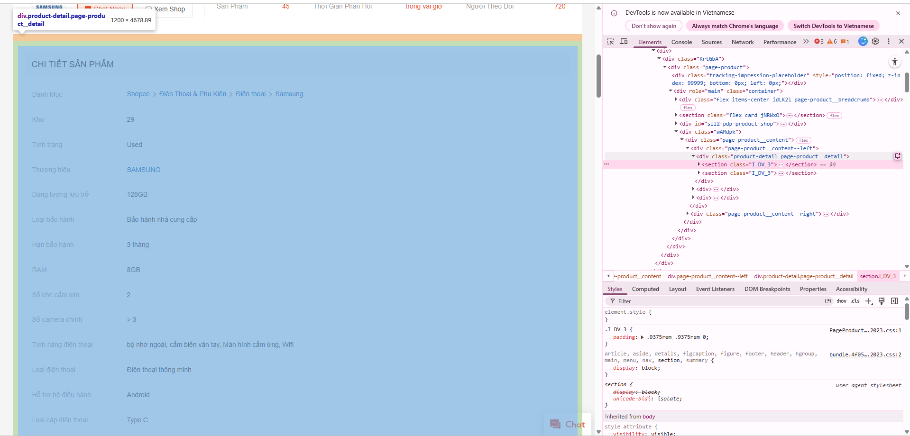

# PHẦN A: ĐỌC HIỂU

__Câu A1:__

I. 5 bước xảy ra khi truy cập https://shopee.vn (theo đúng thứ tự):
- Dựa trên quy trình "Cuộc hành trình 0.3 giây" và kiến trúc "Nhà hàng Online" trong tài liệu (Introduction và phần 1), các bước diễn ra là:

1. Gửi Request (DNS Lookup & Kết nối): Trình duyệt (Client) tiếp nhận URL, tìm địa chỉ IP của server Shopee và gửi yêu cầu (HTTP Request) qua Internet (đi qua router, nhà mạng, cáp quang...).

2. Server xử lý: Server của Shopee nhận được yêu cầu, "đầu bếp" (Server) sẽ xử lý logic, truy xuất dữ liệu (ví dụ: các mặt hàng sale, giỏ hàng của cậu).

3. Gửi Response: Server phản hồi (HTTP Response) bằng cách gửi các file cần thiết (HTML, CSS, JS) ngược trở lại cho trình duyệt qua "anh shipper" Internet.

4. Parse & Execute (Phân tích mã): Trình duyệt nhận file, bắt đầu đọc bản vẽ kiến trúc (Parse HTML), đọc thiết kế nội thất (Parse CSS) và lắp đặt hệ thống tương tác (Execute JS).

5. Paint & Render (Hiển thị): Trình duyệt hoàn thiện việc vẽ các điểm ảnh lên màn hình để cậu thấy giao diện trang chủ Shopee.
- Mở một trình duyệt web trang shopee và đánh giá kết quả tab Network:


__Câu A2:__

- Tại sao Google đánh giá thấp?

Google đọc HTML để **hiểu cấu trúc và nội dung** trang. Khi toàn bộ dùng `<div>`, Google không phân biệt được đâu là header, đâu là nội dung chính, đâu là sản phẩm → không index tốt → SEO kém.

---

❌ 4 Lỗi Semantic (+ bonus)

**Lỗi 1 — Thiếu `<header>`**  
`<div class="header">` không cho Google biết đây là phần đầu trang.

**Lỗi 2 — Thiếu `<nav>`**  
`<div class="menu">` không có tín hiệu điều hướng → Google không nhận ra đây là menu.

**Lỗi 3 — Thiếu `<main>` và `<article>`**  
`<div class="main">` và `<div class="product">` không thể hiện đây là nội dung chính và đơn vị sản phẩm độc lập.

**Lỗi 4 — `` thiếu `alt`**  
Thiếu `alt` → Google Images không index được, vi phạm accessibility.

**Lỗi 5 (bonus) — Thiếu heading tag**  
`<div class="title">` nên là `<h2>` để Google hiểu mức độ quan trọng của tiêu đề sản phẩm.

---

## ✅ Code đã sửa

```html
<header>
    <div class="logo">ShopTLU</div>
    <nav>
        <a href="/">Trang chủ</a>
        <a href="/products">Sản phẩm</a>
    </nav>
</header>

<main>
    <article>
        <h2>iPhone 16 Pro</h2>
        <p class="price">25.990.000đ</p>
        <figure>
            
            <figcaption>iPhone 16 Pro</figcaption>
        </figure>
    </article>
</main>

<footer>© 2026 ShopTLU</footer>
```

---

## 📋 Bảng tóm tắt

| # | Lỗi | Cũ | Sửa |
|---|---|---|---|
| 1 | Header | `<div class="header">` | `<header>` |
| 2 | Navigation | `<div class="menu">` | `<nav>` |
| 3 | Nội dung chính | `<div class="main">` | `<main>` |
| 4 | Sản phẩm | `<div class="product">` | `<article>` |
| 5 | Tiêu đề | `<div class="title">` | `<h2>` |
| 6 | Ảnh | `` | thêm `alt`, `loading="lazy"`, bọc `<figure>` |

__Câu A3:__


```
┌─────────────────────────────────────┐
│ Hộp 1                               │  ← <div> chiếm cả dòng
└─────────────────────────────────────┘
[Text A][Text B]                          ← <span> nằm cạnh nhau
┌─────────────────────────────────────┐
│ Hộp 2                               │  ← <div> chiếm cả dòng
└─────────────────────────────────────┘
[Text C][Text D]                          ← <span> + <strong> cùng dòng
┌─────────────────────────────────────┐
│ Hộp 3                               │  ← <div> chiếm cả dòng
└─────────────────────────────────────┘
```

---

## Giải thích

**`<div>` là block element** → tự động chiếm toàn bộ chiều ngang, phần tử tiếp theo bị đẩy xuống dòng mới. Vì vậy 3 hộp luôn đứng riêng từng dòng.

**`<span>` và `<strong>` là inline element** → chỉ chiếm đúng phần nội dung, các inline element kế tiếp tự động nằm cùng dòng. Đó là lý do:
- `Text A` + `Text B` nằm cạnh nhau
- `Text C` + `Text D` nằm cạnh nhau

**`<div>Hộp 2</div>` chen vào giữa** → làm Text A/B và Text C/D bị tách ra hai nhóm riêng biệt — `<div>` luôn "ngắt dòng" dù nằm giữa các inline element.

---

## Bảng tóm tắt

| Thẻ | Loại | Chiếm chỗ | Xuống dòng? |
|---|---|---|---|
| `<div>` | Block | Cả dòng ngang | Có |
| `<span>` | Inline | Vừa nội dung | Không |
| `<strong>` | Inline | Vừa nội dung | Không |

__Câu A4:__

1. Phân biệt `<thead>`, `<tbody>`, `<tfoot>`

| Thẻ | Vai trò | Nội dung |
|---|---|---|
| `<thead>` | Header bảng | Tiêu đề các cột (`<th>`) |
| `<tbody>` | Thân bảng | Dữ liệu chính (`<td>`) |
| `<tfoot>` | Footer bảng | Tổng kết, tổng cộng (`<td>`) |

**Ví dụ minh họa:**

```html
<table>
    <thead>                          <!-- Tiêu đề cột -->
        <tr>
            <th>Sản phẩm</th>
            <th>Giá</th>
            <th>Tồn kho</th>
        </tr>
    </thead>
    <tbody>                          <!-- Dữ liệu -->
        <tr>
            <td>iPhone 15</td>
            <td>25.990.000đ</td>
            <td>15</td>
        </tr>
    </tbody>
    <tfoot>                          <!-- Tổng kết -->
        <tr>
            <td colspan="2">Tổng</td>
            <td>23</td>
        </tr>
    </tfoot>
</table>
```

---

2. Tại sao KHÔNG dùng `<table>` để layout trang web?

**Lý do 1 — Sai ngữ nghĩa (Semantic)**
`<table>` sinh ra để chứa *dữ liệu dạng bảng*, không phải để chia cột layout. Google và screen reader đọc `<table>` = "đây là bảng dữ liệu" → hiểu sai cấu trúc trang → SEO kém, accessibility kém.

**Lý do 2 — Khó responsive**
Table mặc định có chiều rộng cố định theo nội dung, rất khó co giãn trên màn hình điện thoại. CSS Grid/Flexbox có thể `wrap`, `stack`, ẩn/hiện cột linh hoạt — table thì không.

**Lý do 3 — Code rối, khó bảo trì**
Layout bằng table phải lồng nhiều `<tr>`, `<td>` chỉ để chia cột → HTML phình to, khó đọc, khó sửa. Dùng CSS Grid chỉ cần vài dòng CSS là xong.

**Lý do 4 — Load chậm hơn**
Trình duyệt phải đọc *toàn bộ* table trước khi render (vì cần tính độ rộng từng cột). Layout CSS render từng phần tử ngay lập tức → trang hiển thị nhanh hơn.

---

## Tóm tắt

> `<table>` = dùng cho **dữ liệu** (danh sách sản phẩm, bảng so sánh, thống kê).  
> Layout trang web = dùng **CSS Grid / Flexbox**.

# PHẦN B: THỰC HÀNH

__Câu B1:__

- Tạo profile với:

5đ: Cấu trúc semantic đúng (header/nav/main/article/section/aside/footer)

5đ: Table đúng cấu trúc (thead/tbody/tfoot)

3đ: Meta tags đầy đủ (charset, viewport, title)

2đ: Không dùng div thừa

**Bài làm:**



__Câu B2:__

- Tạo file *products.html* — trang danh sách sản phẩm

5đ: 4+ articles product card đúng cấu trúc

5đ: Table so sánh có colspan/rowspan

3đ: Hyperlinks hoạt động đúng (anchor links và external links)

2đ: Code indentation sạch, readable





__Câu B3:__


Lỗi 1: Dòng 1 <!DOCTYPE> thiếu "html" — Sửa thành <!DOCTYPE html>

Lỗi 2: Dòng 5 Thẻ `<title>` chưa đóng — Thêm `</title>`

Lỗi 3: Dòng 6 charset="utf8" sai chuẩn — Sửa thành UTF-8

Lỗi 4: Dòng 9 Thẻ `<h1>` không đóng đúng — Sửa `</h1>`

Lỗi 5: Dòng 13 Thẻ `<a>` không đóng — Sửa `</a>`

Lỗi 6: Dòng 18 img thiếu dấu ngoặc kép và thiếu alt — Sửa src="iphone.jpg" và thêm alt

Lỗi 7: Dòng 20 Thẻ `<b>` đóng sai vị trí — Đổi thành `<strong>` và đóng đúng thứ tự

Lỗi 8: Dòng 26 Table header dùng `<td>` thay vì `<th>`Sửa thành `<th>`

Lỗi 9: Dòng 36 Dùng 2 thẻ `<main>` là sai semantic — Đổi cái thứ 2 thành `<aside>`

Lỗi 10: Dòng 41 Thẻ `<p>` trong footer chưa đóng — Thêm `</p>`

Lỗi 11: Thiếu thuộc tính lang trong `<html>` Thêm lang="vi"

Lỗi 12: Heading nhảy cấp (h1 → h3) Sửa h3 thành h2 cho đúng semantic

__Câu B4:__


1. 3 thẻ semantic HTML5 mà trang đó sử dụng (Tiki)

- Thẻ `<header>`:


- Thẻ `<main>`:


- Thẻ `<footer>`:



2. Thẻ `<table>`:

- Trong bảng có `<thead>` chứa hình ảnh sản phẩm, `<tbody>` chứa thông tin sản phầm tương ứng với mỗi hàng, mỗi cột của sản phẩm đó



__*- Web tiki không có thẻ form*__

# PHẦN C: SUY LUẬN

__Câu C1:__

- Bạn được giao thiết kế cấu trúc HTML cho trang chi tiết sản phẩm (giống trang sản phẩm Shopee/Tiki). Trang bao gồm:

1. Header + Navigation
2. Breadcrumb (Trang chủ > Điện thoại > iPhone 16)
3. Khu vực ảnh sản phẩm (5 ảnh)
4. hông tin sản phẩm (tên, giá, đánh giá sao, mô tả)
5. Bảng thông số kỹ thuật
6.  Khu vực đánh giá/bình luận
7. Sidebar: Sản phẩm tương tự
8. Footer

Bài làm:

```html
<!DOCTYPE html>
<html lang="vi"> <!-- Ngôn ngữ trang -->
<head>
    <meta charset="UTF-8"> <!-- Hỗ trợ tiếng Việt -->
    <meta name="viewport" content="width=device-width, initial-scale=1.0">
    <title>Chi tiết sản phẩm</title> <!-- Tiêu đề trang -->
</head>
<body>

    <!-- HEADER -->
    <header> <!-- header: chứa phần đầu trang -->
        <div class="logo">Logo</div> <!-- div: nhóm logo -->
        <nav> <!-- khu vực điều hướng chính -->
            <ul> <!-- ul: menu không có thứ tự -->
                <li><a href="#">Trang chủ</a></li>
                <li><a href="#">Danh mục</a></li>
                <li><a href="#">Liên hệ</a></li>
            </ul>
        </nav>
    </header>

    <main> <!-- main: nội dung chính của trang -->
        <!-- BREADCRUMB -->
        <nav aria-label="breadcrumb"> <!-- điều hướng breadcrumb -->
            <ol> <!-- ol: có thứ tự (Trang chủ > ...) -->
                <li><a href="#">Trang chủ</a></li>
                <li><a href="#">Điện thoại</a></li>
                <li aria-current="page">iPhone 16</li> <!-- phần hiện tại -->
            </ol>
        </nav>

        <!-- PRODUCT DETAIL -->
        <section class="product-detail"> <!-- section: nhóm nội dung sản phẩm -->

            <!-- PRODUCT IMAGES -->
            <div class="product-images"> <!-- div: layout ảnh -->
                <figure> <!-- figure: ảnh + chú thích -->
                     <!-- img: ảnh -->
                    <figcaption>Ảnh chính</figcaption> <!-- figcaption: mô tả -->
                </figure>

                <div class="thumbnail-list"> <!-- div: danh sách ảnh nhỏ -->
                    
                    
                    
                    
                    
                </div>
            </div>

            <!-- PRODUCT INFO -->
            <div class="product-info"> <!-- div: nhóm thông tin -->

                <h1>Tên sản phẩm</h1> <!-- h1: tiêu đề chính -->

                <p class="price">Giá</p> <!-- p: văn bản giá -->

                <div class="rating"> <!-- div: nhóm đánh giá -->
                    <span>★★★★★</span> <!-- span: inline text -->
                    <span>(100 đánh giá)</span>
                </div>

                <article class="description"> <!-- article: nội dung độc lập -->
                    <p>Mô tả sản phẩm...</p>
                </article>

            </div>
        </section>

        <!-- SPECIFICATIONS -->
        <section class="specs"> <!-- section: nhóm thông số -->
            <h2>Thông số kỹ thuật</h2> <!-- h2: tiêu đề cấp 2 -->

            <table> <!-- table: dữ liệu dạng bảng -->
                <thead> <!-- thead: phần đầu bảng -->
                    <tr>
                        <th>Thuộc tính</th> <!-- th: tiêu đề cột -->
                        <th>Giá trị</th>
                    </tr>
                </thead>
                <tbody> <!-- tbody: dữ liệu -->
                    <tr>
                        <td>Màn hình</td> <!-- td: ô dữ liệu -->
                        <td>...</td>
                    </tr>
                </tbody>
            </table>
        </section>

        <!-- REVIEWS -->
        <section class="reviews"> <!-- section: đánh giá -->
            <h2>Đánh giá</h2>

            <article class="review"> <!-- article: mỗi đánh giá độc lập -->
                <h3>Tên người dùng</h3>
                <p>Nội dung bình luận...</p>
            </article>

        </section>

        <!-- SIDEBAR -->
        <aside> <!-- aside: nội dung phụ -->
            <h2>Sản phẩm tương tự</h2>

            <ul> <!-- ul: danh sách sản phẩm -->
                <li><a href="#">Sản phẩm 1</a></li>
                <li><a href="#">Sản phẩm 2</a></li>
            </ul>
        </aside>

    </main>

    <!-- FOOTER -->
    <footer> <!-- footer: chân trang -->
        <p>&copy; 2026 Công ty</p>
    </footer>

</body>
</html>
```

__Câu C2:__

- Một đồng nghiệp nói: "Dùng `<div>` cho mọi thứ rồi thêm class là được, không cần semantic HTML. Tốn thời gian học thêm thẻ mới."

Viết 1 đoạn phản biện (200-300 từ), phải bao gồm:
Ít nhất 2 lý do kỹ thuật (SEO, Accessibility)
1 ví dụ cụ thể chứng minh semantic HTML giúp ích
1 trường hợp thực tế mà `<div>` vẫn phù hợp

**Bài làm:**

Quan điểm “dùng `<div>` cho mọi thứ” nghe có vẻ nhanh, nhưng về kỹ thuật lại tạo ra chi phí ẩn đáng kể. Thứ nhất là **SEO**: các công cụ tìm kiếm không chỉ đọc nội dung mà còn dựa vào cấu trúc ngữ nghĩa để hiểu trang. Những thẻ như `<header>`, `<main>`, `<article>`, `<nav>` giúp xác định rõ đâu là nội dung chính, đâu là điều hướng, từ đó cải thiện khả năng index và xếp hạng. Nếu chỉ dùng `<div>`, bạn phải phụ thuộc vào class — vốn không mang nhiều giá trị ngữ nghĩa đối với bot. Thứ hai là **Accessibility (trợ năng)**: các screen reader như NVDA hay VoiceOver dựa vào semantic HTML để điều hướng nhanh. Người dùng có thể nhảy trực tiếp tới `<main>` hoặc `<nav>` thay vì đọc toàn bộ trang. Nếu dùng `<div>`, bạn buộc phải bổ sung ARIA phức tạp hơn và dễ sai. Ví dụ cụ thể: breadcrumb sử dụng `<nav aria-label="breadcrumb">` kết hợp `<ol>` giúp công cụ hỗ trợ hiểu đây là điều hướng có thứ tự; nếu thay bằng `<div>`, bạn phải “vá” thêm nhiều thuộc tính mà vẫn kém hiệu quả. Tuy vậy, `<div>` vẫn phù hợp trong các trường hợp layout thuần túy như wrapper cho flex/grid hoặc grouping không mang ý nghĩa nội dung. Vấn đề không phải loại bỏ
`<div>`, mà là sử dụng đúng vai trò: semantic cho ý nghĩa, `<div>` cho trình bày.