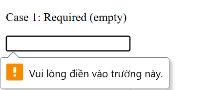
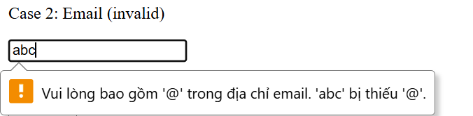
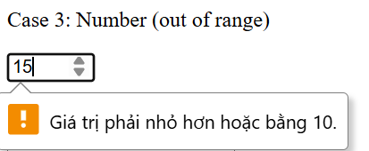
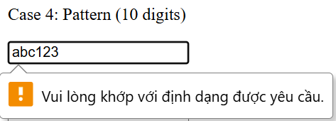
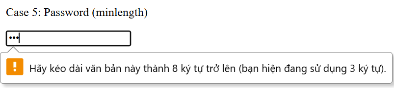
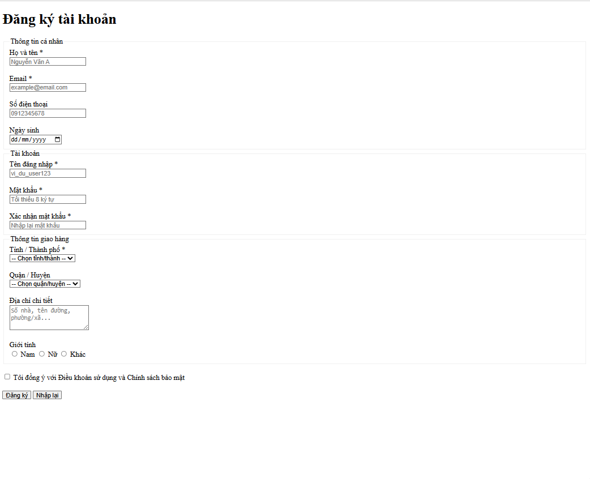
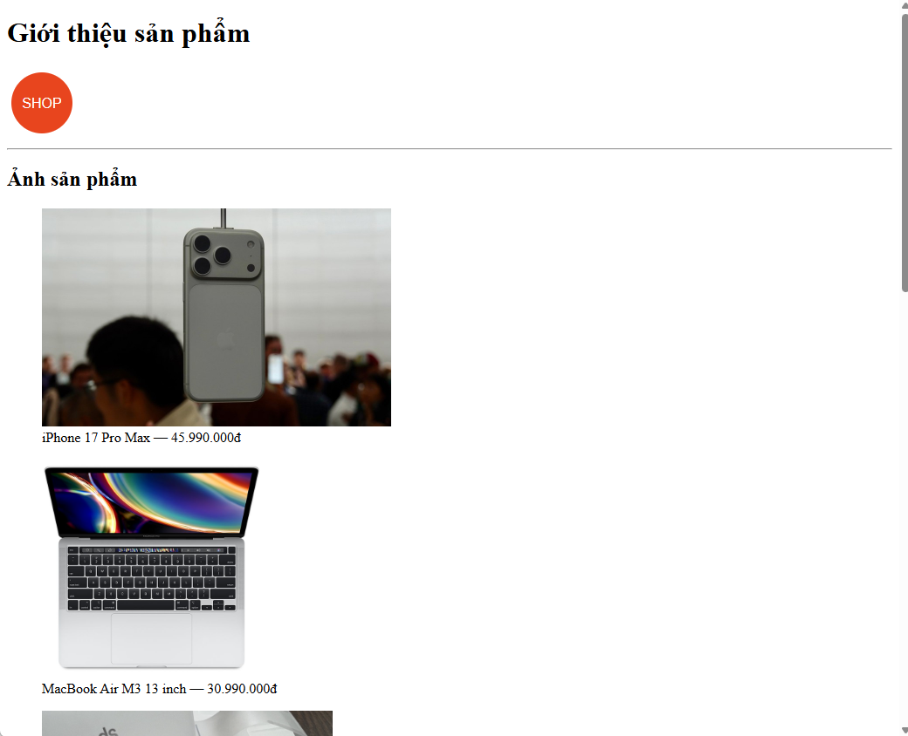
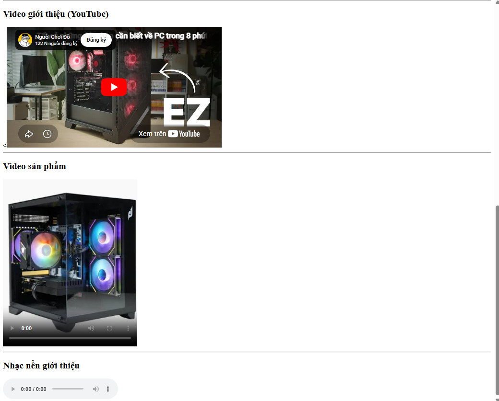
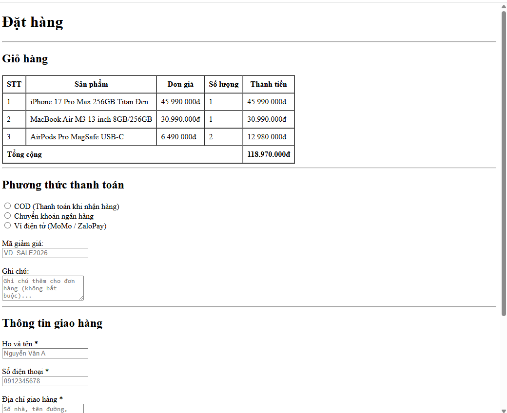
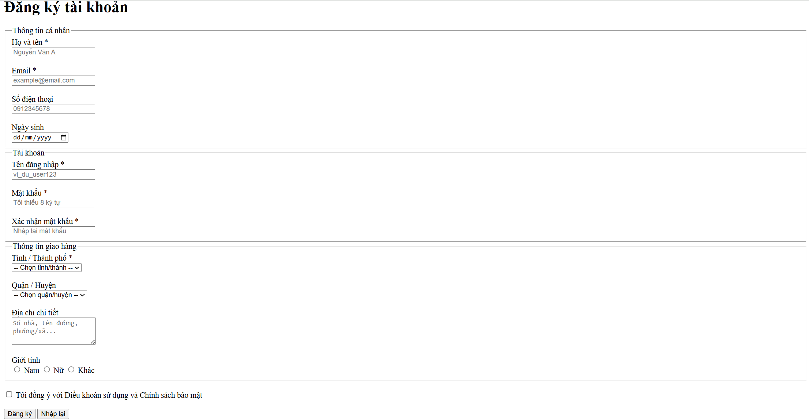

# PHẦN A
__Câu A1:__ Input Types trong HTML5

1. **type="email"** → Ô nhập text, tự kiểm tra có `@` → Dùng cho form đăng ký

2. **type="password"** → Ô nhập text nhưng ký tự bị ẩn ký tự bằng `•` → Không có validation mặc định (chỉ hỗ trợ `required`, `minlength`,...) → Dùng cho đăng nhập / tạo tài khoản

3. **type="number"** → Ô nhập số, có nút tăng/giảm → Chỉ cho nhập số, có thể giới hạn `min`, `max` → Dùng nhập số lượng sản phẩm

4. **type="tel"** → Ô nhập text → Không validation chặt (chỉ hỗ trợ pattern nếu thêm) → Dùng nhập số điện thoại

5. **type="url"** → Ô nhập text → Tự kiểm tra định dạng URL hợp lệ → Dùng khi nhập link website

6. **type="date"** → Giao diện chọn ngày → Tự đảm bảo định dạng ngày hợp lệ → Dùng chọn ngày giao hàng/ngày sinh

7. **type="file"** → Nút chọn file từ máy → Có thể giới hạn loại file bằng `accept` → Dùng upload ảnh sản phẩm/avatar

8. **type="checkbox"** → Ô vuông tích chọn (có thể chọn nhiều) → Không validation mặc định (trừ khi dùng `required`) → Dùng chọn nhiều sản phẩm/chọn điều khoản

9. **type="radio"** → Nút chọn tròn (chỉ chọn 1 trong nhóm) → Không validation mặc định (trừ khi `required`) → Dùng chọn phương thức thanh toán

10. **type="range"** → Thanh kéo số lượng → Giới hạn giá trị theo `min`, `max` → Dùng lọc giá sản phẩm

__Câu A2:__

- **Trường hợp 1**



Khi bấm Submit, form không được gửi vì input có thuộc tính `required` nhưng giá trị đang rỗng. Trình duyệt sẽ yêu cầu người dùng nhập dữ liệu trước khi tiếp tục.

- **Trường hợp 2**



Form không được gửi vì do `type="email"`, yêu cầu định dạng email hợp lệ (phải có `@domain`)

- **Trường hợp 3**



Form không được gửi vì giá trị nhập là `15` vượt quá giới hạn `max="10"`. Trình duyệt phát hiện vi phạm khoảng giá trị và không cho submit.

- **Trường hợp 4**



Form không được gửi vì giá trị `"abc123"` không khớp với `pattern="[0-9]{10}"`, vốn yêu cầu đúng 10 chữ số liên tiếp. Do không match regex nên bị chặn.

- **Trường hợp 5**



Form không được gửi vì mật khẩu `"123"` có độ dài nhỏ hơn `minlength="8"`. Trình duyệt yêu cầu nhập đủ số ký tự tối thiểu trước khi cho submit.

__*→ Các dự đoán đều đúng*__

__Câu A3:__

- **Tại sao `<label for="email">` quan trọng?**

Thẻ `<label>` liên kết trực tiếp với ô input thông qua thuộc tính `for` (trùng với `id="email"`). Khi đó, screen reader sẽ đọc nội dung của label trước khi đọc ô nhập, giúp người dùng hiểu chính xác cần nhập thông tin gì. Nếu không có `<label>`, người dùng không xác định được “input” nhập, gây khó khăn khi sử dụng form. `"for"` làm cho khi click vào label sẽ focus sang input có `id` trùng với `for`.

- **Khi nào dùng `<fieldset>` + `<legend>`? Cho ví dụ**

Dùng khi cần nhóm nhiều trường nhập liệu có liên quan về mặt ngữ nghĩa. `<fieldset>` là khối chứa, còn `<legend>` là tiêu đề mô tả cho nhóm đó, giúp cung cấp ngữ cảnh cho người dùng.

**Ví dụ:**
```html
<fieldset>
    <legend>Thông tin giao hàng</legend> <!-- Tiêu đề khối nhóm -->

    <label for="name">Tên:</label>
    <input type="text" id="name">

    <label for="phone">SĐT:</label>
    <input type="text" id="phone">

    <label for="addr">Địa chỉ:</label>
    <input type="text" id="addr">
</fieldset>

```
> Mặc dù `Tên, SĐT, Địa chỉ` có rất nhiều ngữ cảnh sử dụng, nhưng khi có `<legend>` người đọc sẽ hiểu thông tin đó của thuộc loại khối thông tin nào

- **`aria-label` dùng khi nào? Tại sao KHÔNG nên dùng khi đã có `<label>`**

`<aria-label>` được dùng khi phần tử không có nội dung text rõ ràng (ví dụ button chỉ có icon) để cung cấp mô tả cho screen reader. Không nên dùng khi đã có `<label>` vì `<label>`là cách chuẩn mô tả, có ngữ nghĩa trong HTML. Việc dùng cả hai có thể gây trùng lặp hoặc xung đột thông tin, khiến screen reader đọc không nhất quán. Chỉ nên dùng aria-label khi không thể sử dụng `<label>`.

__Câu A4:__ Media

- **`loading="lazy"` trên `` là gì? Cải thiện gì? Khi nào KHÔNG nên dùng?**

Thuộc tính `loading="lazy"` cho phép trình duyệt trì hoãn việc tải ảnh cho đến khi ảnh gần xuất hiện trong vùng nhìn thấy, tức là người dùng scroll đến đâu thì ảnh mới load đến đó. Điều này giúp cải thiện hiệu năng trang web bằng cách giảm thời gian tải ban đầu, tiết kiệm băng thông và tăng tốc độ hiển thị, đặc biệt hữu ích với các trang có nhiều hình ảnh như e-commerce.

**Không nên dùng** với ảnh xuất hiện ngay khi trang vừa load. Ví dụ banner đầu trang, logo, vì lazy loading sẽ làm ảnh bị trễ, gây trải nghiệm xấu.

- **Tại sao nên cung cấp nhiều `<source>` trong thẻ `<video>`? Liệt kê ít nhất 3 format video phổ biến**

Vì không phải trình duyệt nào cũng hỗ trợ cùng 1 định dạng video. Trình duyệt đọc các `<source>` từ trên xuống và dùng cái đầu tiên nó hỗ trợ được, nếu không có `<source>` nào phù hợp thì video không phát được.

| Format | Type | Trình duyệt hỗ trợ |
|---|---|---|
| `.mp4` (H.264) | `video/mp4` | Hầu hết tất cả |
| `.webm` | `video/webm` | Chrome, Firefox, Edge |
| `.ogv` | `video/ogg` | Firefox, Chrome cũ |

> Nên đặt format ít phổ biến trước, `.mp4` để cuối làm fallback vì hỗ trợ rộng nhất.

- **Thuộc tính `alt` trên `` dùng để làm gì? Viết `alt` tốt cho 3 trường hợp**

Thuộc tính `alt` cung cấp văn bản thay thế cho ảnh khi ảnh không load được hoặc khi screen reader đọc trang cho người dùng khiếm thị. `alt` tốt phải mô tả **nội dung và mục đích** của ảnh, không phải mô tả kiểu "image of..." hay để trống tùy tiện.

**Ảnh sản phẩm iPhone 16:**
```html

```
→ Mô tả cụ thể sản phẩm, màu sắc, góc chụp giúp người dùng hình dung sản phẩm.

**Ảnh trang trí (decorative):**
```html

```
→ Để `alt=""` (rỗng) screen reader sẽ bỏ qua ảnh này, tránh đọc thông tin thừa không có nghĩa.

**Ảnh biểu đồ doanh thu Q1/2026:**
```html

```
→ Mô tả đầy đủ dữ liệu trong biểu đồ vì người dùng không nhìn được ảnh cần hiểu được nội dung.

__CÂU A5:__  So sánh `<figure>` vs ``

```html

<!-- Cách 1 -->


```

> Dùng `` khi nội dung ảnh liên kết với nội dung văn bản, không cần chú thích hay chia khối độc lập riêng

```html

<!-- Cách 2 -->
<figure>
    
    <figcaption>iPhone 16 Pro Max — 25.990.000đ</figcaption>
</figure>

```

> Dùng `<figure>` khi ảnh cần chú thích mô tả đi kèm `<figcaption>` hoặc khi ảnh mang ý nghĩa tách biệt với luồng văn bản chính

# PHẦN B

__Bài B1:__



__Bài B2:__



__Bài B3:__





# PHẦN C

__Câu C1:__

- Lỗi 0: Dòng 1 - form thiếu `action` và `method` để submit

Sửa:
```html
<form action="#" method="POST">
```

- Lỗi 1: Dòng 2 - Input “Tên” không có `<label for="...">`, vi phạm accessibility

Sửa:
```html
<label for="name">Tên:</label>
<input type="text" id="name" name="name" required>
```

- Lỗi 2: Dòng 4 - Input email không có `<label>`

Sửa:
```html
<label for="email">Email:</label>
<input type="email" id="email" name="email" placeholder="Email của bạn" required>
```

- Lỗi 3: Dòng 6 - Input mật khẩu không có `<label>`

Sửa:
```html
<label for="password">Mật khẩu:</label>
<input type="password" id="password" name="password" required>
```

- Lỗi 4: Dòng 7 - Input nhập lại mật khẩu không có `<label>`

Sửa:
```html
<label for="confirm-password">Nhập lại mật khẩu:</label>
<input type="password" id="confirm-password" name="confirm_password" required>
```

- Lỗi 5: Dòng 9 - Phone dùng `type="text"` thay vì `tel`

Sửa:
```html
<label for="phone">Phone:</label>
<input type="tel" id="phone" name="phone" placeholder="0901234567" required>
```

- Lỗi 6: Dòng 9 - Phone có `value` mặc định, không có `placeholder`(UX kém)

Sửa:
```html
<input type="tel" id="phone" name="phone" placeholder="0901234567" required>
```

- Lỗi 7: Dòng 11 - `<select>` không có `<label>`

Sửa:
```html
<label for="city">Thành phố:</label>
<select id="city" name="city" required>
    <option value="">--Chọn--</option>
    <option value="hn">Hà Nội</option>
    <option value="hcm">TP.HCM</option>
</select>
```

- Lỗi 8: Dòng 15 - Thiếu `checkbox` cho “đồng ý điều khoản” và `for` của label

Sửa:
```html
<input type="checkbox" id="agree" name="agree" required>
<label for="agree">Tôi đồng ý điều khoản</label>
```

**Form hoàn chỉnh sau khi sửa**

```html
<form action="#" method="POST">
    <label for="name">Tên:</label>
    <input type="text" id="name" name="name" required>

    <label for="email">Email:</label>
    <input type="email" id="email" name="email" placeholder="Email của bạn" required>

    <label for="password">Mật khẩu:</label>
    <input type="password" id="password" name="password" required>

    <label for="confirm-password">Nhập lại mật khẩu:</label>
    <input type="password" id="confirm-password" name="confirm_password" required>

    <label for="phone">Phone:</label>
    <input type="tel" id="phone" name="phone" placeholder="0901234567" required>

    <label for="city">Thành phố:</label>
    <select id="city" name="city" required>
        <option value="">--Chọn--</option>
        <option value="hn">Hà Nội</option>
        <option value="hcm">TP.HCM</option>
    </select>

    <input type="checkbox" id="agree" name="agree" required>
    <label for="agree">Tôi đồng ý điều khoản</label>

    <input type="submit" value="Gửi">
</form>
```

Câu C2 (10đ) — Validation Strategy

**Pattern Regex:**

CMND/CCCD (12 chữ số):
```regex
^[0-9]{12}$
```

Số tài khoản (10–15 chữ số):
```regex
^[0-9]{10,15}$
```

PIN (6 chữ số, ẩn):
```html
<input type="password" pattern="^[0-9]{6}$" required>
```

**HTML5 validation có đủ an toàn không?**

Không đủ. Vì:
- chạy phía client, dễ bypass  
- có thể gửi request thủ công  
- không kiểm soát logic backend  
- không chống tấn công  

> Bắt buộc validate ở backend.

**3 loại validation HTML5 không làm được**

1. So khớp dữ liệu (password = confirm)  
2. Logic phụ thuộc dữ liệu (số tiền ≤ số dư)  
3. Rule nghiệp vụ (OTP, kiểm tra tồn tại, ...)  

**2 rủi ro nếu chỉ validate frontend**

1. Gửi dữ liệu độc hại lên server  
2. Dẫn đến SQL Injection / XSS  

# PHẦN D
