# PHIẾU BÀI TẬP 03

## PHẦN A:

### Câu A1:

- Inline CSS:

**Ví dụ:**

```html
<p style="color: red; font-size: 20px">Hello</p>
```

> **Ưu điểm:** Áp dụng trực tiếp, nhanh, độ ưu tiên cao

> **Nhược điểm:** Khó bảo trì, code rối khi có nhiều CSS, không SEO tốt, không tái sử dụng được

**Nên dùng khi** sử dụng ít thuộc tính css, đặt mức ưu tiên cao, không thể bị refix

- Internal CSS:

**Ví dụ:**

```html
<head>
    <style>
        p{
          color: red; 
          font-size: 20px
        }
    </style>
</head>
```
> **Ưu điểm:** Dễ đọc property css, tái sử dụng được các selector

> **Nhược điểm:** code web dài, khó tìm selector, kiểm soát css khó khăn, không tái sử dụng được cho nhiều web

**Nên dùng khi** website nhỏ, chỉ sử dụng cho một trang


- External CSS:

**Ví dụ:**

```html
<head>
  <link rel="stylesheet" href="styles.css">
</head>
```
Local file styles.css (đang cùng cấp vs file html):

```css
p {
  color: red;
  font-size: 20px;
}
```
> **Ưu điểm:** Tái sử dụng được 1 file cho nhiều trang web, code css - html rõ ràng, dễ kiểm soát, dễ bảo trì, scale tốt

> **Nhược điểm:** phụ thuộc vào link file css, phải load thêm dữ liệu file

**Nên dùng khi** website nhiều trang, tái sử dụng cho nhiều project khi file chứa css có thể dùng chung cho các website làm về một lĩnh vực cụ thể

***Tài liệu tham chiếu:*** https://github.com/hieutachi/CCC_Frontend_2026/blob/main/tuan_2_css_core/08_introduction_css.md#-3-c%C3%A1ch-th%C3%AAm-css

### Câu A2:

```html
<div id="app">
    <header class="top-bar dark">
        <h1>ShopTLU</h1>
        <nav>
            <a href="/" class="active">Home</a>
            <a href="/products">Products</a>
            <a href="/about">About</a>
        </nav>
    </header>
    <main>
        <article class="product">
            <h2>iPhone 16</h2>
            <p class="price">25.990.000đ</p>
            <p>Mô tả sản phẩm...</p>
        </article>
        <article class="product featured">
            <h2>MacBook Pro</h2>
            <p class="price">45.990.000đ</p>
            <p>Mô tả sản phẩm...</p>
        </article>
    </main>
</div>
```

#### Đánh giá qua mỗi kiểu selector:

1. `h1`  → Chọn: `<h1>ShopTLU</h1>`
2. `.price`  → Chọn: `<p class="price">25.990.000đ</p>`, `<p class="price">45.990.000đ</p>`
3. `#app header`  → Chọn: 
```html
    <header class="top-bar dark">
        <h1>ShopTLU</h1>
        <nav>
            <a href="/" class="active">Home</a>
            <a href="/products">Products</a>
            <a href="/about">About</a>
        </nav>
    </header>
```
4. `nav a:first-child` → Chọn: `<a href="/" class="active">Home</a>`
5. `.product.featured h2` → Chọn: `<h2>MacBook Pro</h2>`
6. `article > p` → Chọn: `<p class="price">25.990.000đ</p>`, `<p>Mô tả sản phẩm...</p>`, `<p class="price">45.990.000đ</p>`,  `<p>Mô tả sản phẩm...</p>`
7. `a[href="/"]`  → Chọn: `<a href="/" class="active">Home</a>`
8. `.top-bar.dark h1` → Chọn: `<h1>ShopTLU</h1>`

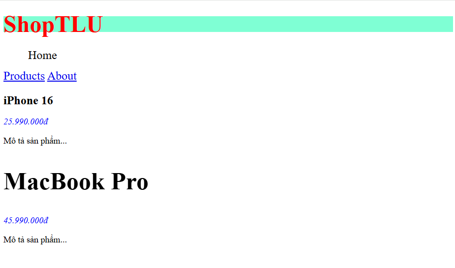

***Tài liệu tham chiếu:*** https://github.com/hieutachi/CCC_Frontend_2026/blob/main/tuan_2_css_core/09_css_selectors.md#-5-lo%E1%BA%A1i-selector--t%E1%BB%AB-r%E1%BB%99ng-%C4%91%E1%BA%BFn-h%E1%BA%B9p

https://github.com/hieutachi/CCC_Frontend_2026/blob/main/tuan_2_css_core/09_css_selectors.md#-combinator-selectors--ch%E1%BB%8Dn-theo-m%E1%BB%91i-quan-h%E1%BB%87

https://github.com/hieutachi/CCC_Frontend_2026/blob/main/tuan_2_css_core/09_css_selectors.md#-pseudo-classes--pseudo-elements
### Câu A3:

- Trường hợp 1: content-box (mặc định)

```css
.box-1 {
    width: 400px;
    padding: 20px;
    border: 5px solid black;
    margin: 10px;
}
```

→ Chiều rộng hiển thị = 400px (content) + 40px (padding x2) + 10px (border x2) = 450px 

→ Không gian chiếm trên trang = 400px (content) + 40px (padding x2) + 10px (border x2) + 20px (margin x2) = 470px 

- Trường hợp 2: border-box

```css
.box-2 {
    box-sizing: border-box;
    width: 400px;
    padding: 20px;
    border: 5px solid black;
    margin: 10px;
}
```

→ Chiều rộng hiển thị = 400px (witdh = content + padding + border)

→ Kích thước content thực tế = 400px - 40px - 10px = 350px 
(content = witdh - padding - border)

→ Không gian chiếm trên trang = 400px + 20px = 420px

- Trường hợp 3: Margin collapse

```css
.box-a { margin-bottom: 25px; }
.box-b { margin-top: 40px; }
```

→ Khoảng cách giữa box-a và box-b = 40px

→ Giải thích tại sao **KHÔNG PHẢI** 65px: vì trong css có cơ chế collapse các margin ***theo chiều dọc***, lấy giá trị lớn hơn làm khoảng cách. Nguyên do để tránh các box-model phình to không kiểm soát

**Nếu .box-a có margin-bottom: -10px và .box-b có margin-top: 40px, khoảng cách = bao nhiêu?**

> Khoảng cách sẽ là 30px vì collaspe chỉ hoạt động theo cơ chế lấy max/min margin giữa 2 box làm khoảng cách tùy theo 2 box có đang cùng đẩy/thu marign (tức value có cùng dấu +/-)

***Tài liệu tham chiếu:*** https://github.com/hieutachi/CCC_Frontend_2026/blob/main/tuan_2_css_core/11_box_model.md#2-border-box--gi%E1%BA%A3i-ph%C3%A1p-m%E1%BB%99t-d%C3%B2ng-c%E1%BB%A9u-ng%C3%A0n-d%C3%B2ng

https://github.com/hieutachi/CCC_Frontend_2026/blob/main/tuan_2_css_core/11_box_model.md#3-designing-boxes--c%C3%A1c-k%E1%BB%B9-thu%E1%BA%ADt-th%E1%BB%B1c-t%E1%BA%BF
### Câu A4:

Cho các CSS rules sau cùng target 1 element `<p class="price" id="main-price">`:

```css
p { color: black; }                    /* Rule A */
.price { color: blue; }               /* Rule B */
#main-price { color: red; }           /* Rule C */
p.price { color: green; }             /* Rule D */
```

1. Tính specificity score (a, b, c) cho mỗi rule
2. Element sẽ có màu gì? Giải thích
3. Nếu thêm `<p class="price" id="main-price" style="color: orange;">`, element có màu gì?
4. Nếu Rule A thêm !important, element có màu gì? Tại sao?

**Bài làm:**

1. 
```text
-Rule A: (0,0,1) 
-Rule B: (0,1,0)
-Rule C: (1,0,0)
-Rule D: (0,1,1)
``` 
2. Element có màu đỏ, vì Rule C có specificity cao nhất (#id)
3. Element có màu cam, vì inline CSS trên tất cả các selector trong file/style CSS trừ !important
4. Element có màu đen, vì !important là specificity cao nhất

***Tài liệu tham chiếu:*** https://github.com/hieutachi/CCC_Frontend_2026/blob/main/tuan_2_css_core/09_css_selectors.md#%EF%B8%8F-specificity--ai-th%E1%BA%AFng-khi-xung-%C4%91%E1%BB%99t
## PHẦN B:

### Bài B1:

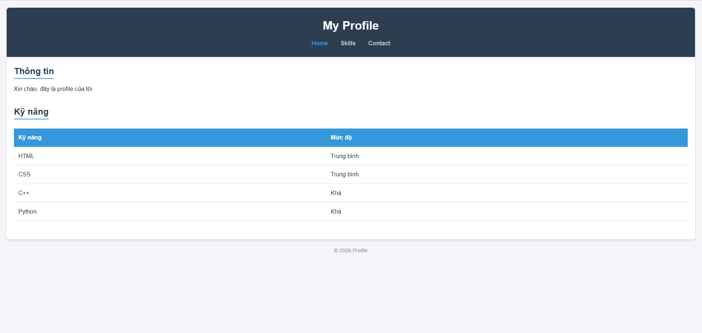

### Bài B2:

#### Phần 1:

- Hộp 1:

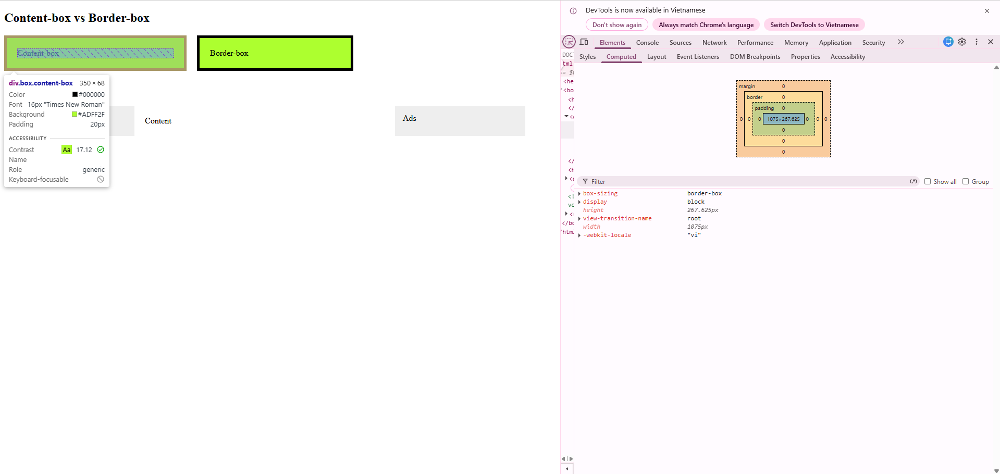

- Hộp 2:

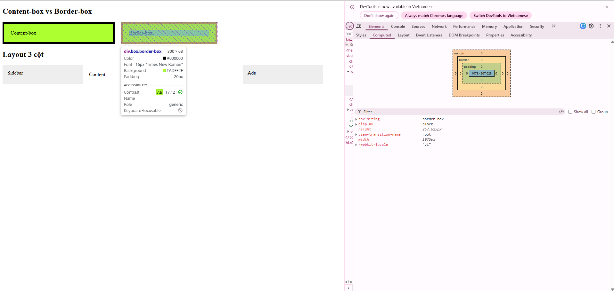

Hộp 1 (content-box): chiều rộng thực tế =  350px (đo từ DevTools)

Hộp 2 (border-box): chiều rộng thực tế = 300px (đo từ DevTools)

**Giải thích:**

> Nguyên nhân do width của box, sẽ tính theo từ content hay từ border vào trong tùy vào value được đặt. Với hộp 1 (content-box), width được tính trong vùng content, padding và border được cộng thêm ra bên ngoài vùng này. Còn ở hộp 2 (border-box), width được tính cho toàn bộ hộp (content + padding + border), cho nên khi đặt width rộng bao nhiêu thì chiều rộng hộp sẽ hiển thị bấy nhiêu. Đặc biệt khi dùng border-box, nếu tăng size vùng padding hoặc border thì content sẽ thu hẹp lại để đảm bảo tổng kích thước của box không đổi

#### Phần 2:

**\-Trường hợp không dùng border-box:**

**Sidebar:** 

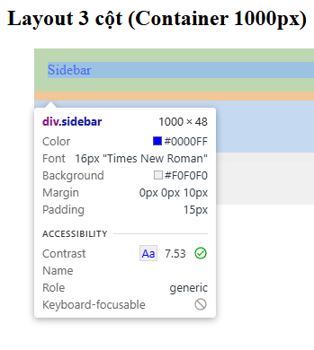

**Content:**

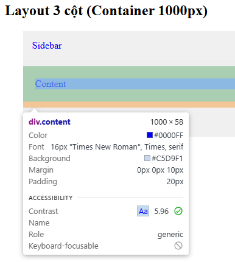

**Ads:**

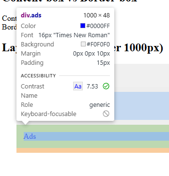

**Tổng** = 970px(Sidebar) + 960px(Content) + 970px(Ads) = 2900px

**\-Trường hợp dùng border-box:**

**Sidebar:** 

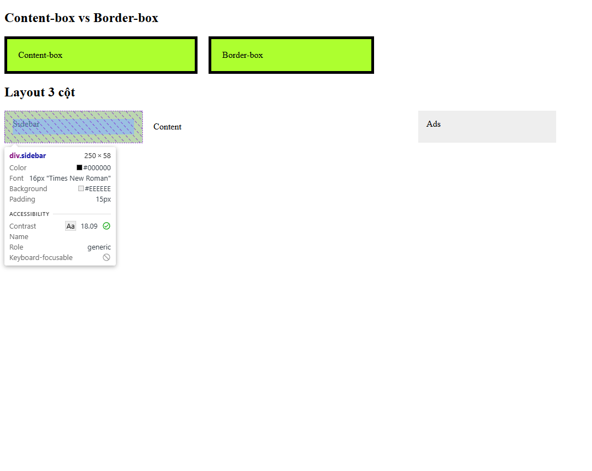

**Content:**

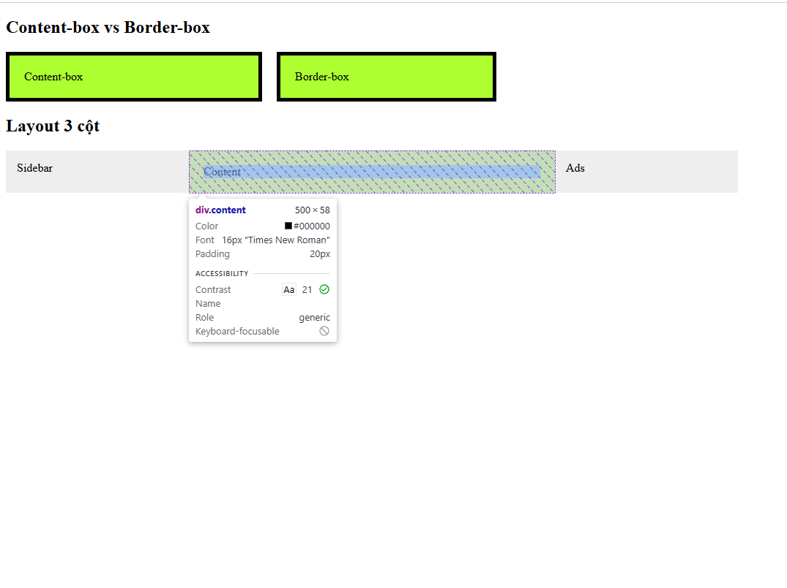

**Ads:**

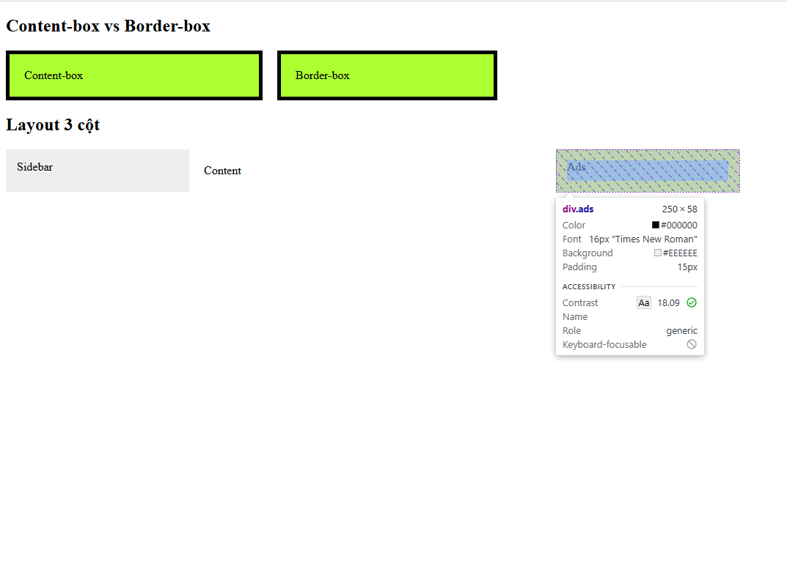

**Tổng** = 250px(Sidebar) + 500px(Content) + 250px(Ads) = 1000px

### Bài B3:

1. 10 Rules + specificity score:

```css
/* Specificity(0, 0, 0) */
* {
    color: gray;
}

/* Specificity(0, 0, 1) */
p{
    color: silver;
}

/* Specificity(0, 0, 2) */
main p{
    color: brown;
}

/* Specificity(0, 1, 0) */
.text{
    color: blue;
}

/* Specificity(0, 1, 1) */
p.text{
    color: green;
}

/* Specificity(0, 2, 0) */
.text.highlight{
    color: purple;
}

/* Specificity(0, 2, 1) */
p.text.highlight{
    color: orange;
}

/* Specificity(1, 0, 0) */
#demo{
    color: gold;
}

/* Specificity(1, 1, 0) */
.text#demo{
    color: pink;
}

/* Specificity(1, 2, 1) */
p.text.highlight#demo{
    color: red;
}
```

2. Element cuối cùng hiển thị `color: red` vì nó là specificity cao nhất.

3. Kết quả:

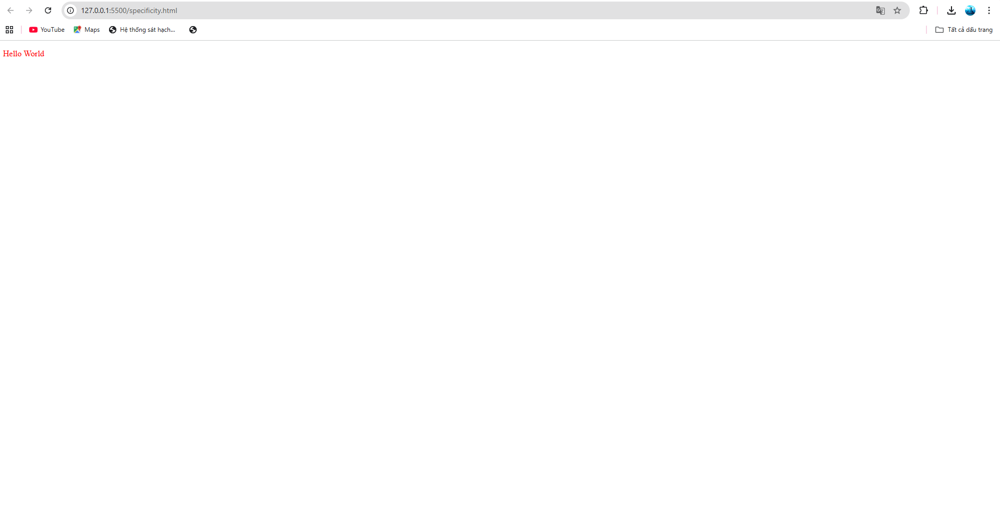

4. Thay đổi thứ tự rules trong CSS file không làm thay đổi các property vì specificity mức thấp không thể đè lên mức cao, chỉ có thể đè lên khi có cùng mức độ và được liệt kê cuối cùng

## PHẦN C:

### Câu C1:

```css
.container {
    width: 960px;
    margin: 0 auto;
}
.main {
    width: 960px;
    margin: 0 auto;
}
.sidebar {
    color: #000000;  
    width: 300px;
    padding: 20px;
    border: 1px solid #ccc;
    float: left;
    box-sizing: border-box;
}
.content {
    width: 660px;
    padding: 20px;
    border: 1px solid #cccccc;
    float: left;
    box-sizing: border-box;
}
.container-c2 {
    width: 960px;
    height: 60px;
    margin:  0 auto;
    display: flex;
    
}
.sidebar-c2 {
    width: 300px;
    padding: 20px;
    border: 1px solid #ccc;
    float: left;
}
.content-c2 {
    width: 660px;
    padding: 20px;
    border: 1px solid #ccc;
    float: left;
}

```

1. width thực tế (content-box) của sidebar = 342px và của content = 722px

2. Layout vỡ bởi vì tổng width (sidebar + content = 1064px) > width container cho nên sẽ đẩy phần chiếm sau cùng xuống dòng để đủ chỗ chứa
3. Cách sửa là dùng `border-box`: khi dùng border-box khối tổng width của sidebar và content = 300px + 660px = 960px = width của container. Cách thứ hai là đặt `display: flex` trong container để kích thước các khối luôn nằm vừa vặn trên 1 hàng
4. Chứng minh 2 cách hoạt động:

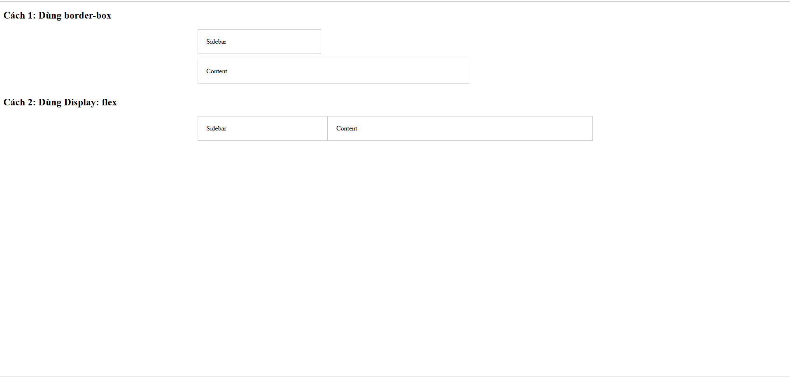

***Tài liệu tham chiếu:*** https://github.com/hieutachi/CCC_Frontend_2026/blob/main/tuan_2_css_core/11_box_model.md#2-border-box--gi%E1%BA%A3i-ph%C3%A1p-m%E1%BB%99t-d%C3%B2ng-c%E1%BB%A9u-ng%C3%A0n-d%C3%B2ng
### Câu C2:

**CSS:**
```css
body { font-size: 16px; color: #333; } /* (0,0,1) */
.container { font-size: 14px; } /* (0,1,0) */
.card { color: blue; } /* (0,1,0) */
.card .title { font-size: 20px; } /* (0,2,0) */
.card p { color: inherit; } /* (0,1,1) */
#featured .title { color: red; } /* (1,1,0) */
.highlight { color: green !important; } /* max */
```
**HTML:**
```html
<body>
    <div class="container">
        <div class="card" id="featured">
            <h2 class="title highlight">Sản phẩm A</h2>
            <p>Mô tả sản phẩm</p>
        </div>
        <div class="card">
            <h2 class="title">Sản phẩm B</h2>
            <p class="highlight">Mô tả sản phẩm B</p>
        </div>
    </div>
</body>
```
1. "Sản phẩm A" (h2) có `font-size = 20px` vì (.card .title) > .container và `color = green` vì có .hightlight ở mức cao nhất 
2. "Mô tả sản phẩm" (p trong card featured) có `color = blue`  vì (.card p) có color cao nhất đang kế thừa .card có color = blue
3. "Sản phẩm B" (h2) có `font-size = 20px` vì (.card .title) > .container và `color = blue` vì .card > body
4. "Mô tả sản phẩm B" (p.highlight) có `color = green` vì có .hightlight ở mức cao nhất 

**Chạy code:**

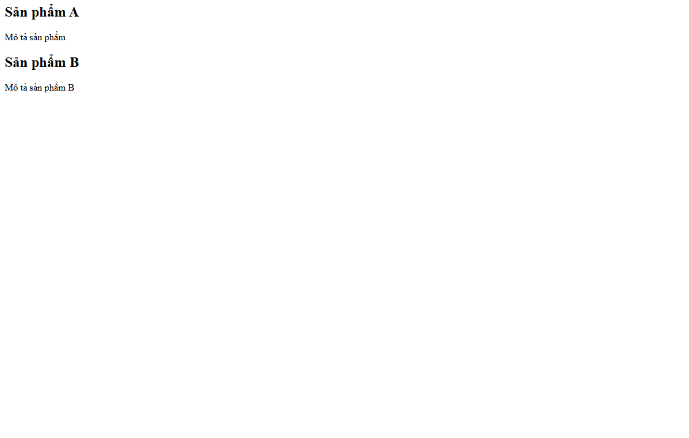

***Tài liệu tham chiếu:*** https://github.com/hieutachi/CCC_Frontend_2026/blob/main/tuan_2_css_core/09_css_selectors.md#%EF%B8%8F-specificity--ai-th%E1%BA%AFng-khi-xung-%C4%91%E1%BB%99t