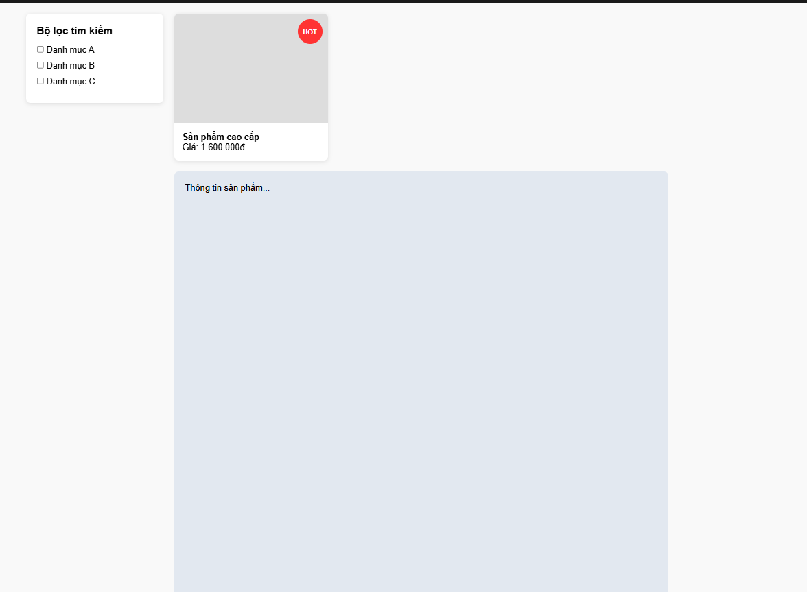
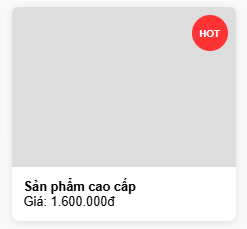

## PHẦN A

### Câu A1:

| Position | Vẫn chiếm chỗ trong flow? | Tham chiếu vị trí | Cuộn theo trang? | Use case |
|----------|---------------------------|-------------------|------------------|----------|
| `static` | Có | Theo luồng tự nhiên (Normal flow) | Có | Giá trị mặc định ban đầu của mọi element. |
| `relative`| Có | Vị trí gốc ban đầu của chính nó | Có | Làm gốc tọa độ cho phần tử con dùng `absolute`. |
| `absolute`| Không | Nearest Positioned Ancestor (Tổ tiên gần nhất khác static) | Có | Làm badge thông báo, icon xóa góc card, dropdown menu. |
| `fixed`  | Không | Khung hình trình duyệt (Viewport) | Không | Header dính đỉnh trang, nút "Scroll to top", chat box. |
| `sticky` | Có (khi chưa dính) | Normal flow / Viewport khi cuộn đến mốc | Có | Thanh bộ lọc Sidebar, tiêu đề section của bảng dữ liệu. |

**Khi nào `absolute` tham chiếu `body`?** Khi tất cả các phần tử cha/tổ tiên bao bọc nó đều có `position: static` (hoặc không khai báo position).

**Khi nào tham chiếu parent?** Khi phần tử cha gần nhất được gán `position` khác `static` (thường dùng `position: relative`).

**Khái niệm "Nearest Positioned Ancestor":** Là phần tử cha/tổ tiên gần nhất tính từ phần tử hiện tại ngược lên gốc cây DOM có giá trị thuộc tính `position` khác `static`.

### Câu A2:

- Trường hợp 1: `display: flex;` + `flex: 1;` (4 items)

**Bố cục:** 1 hàng ngang duy nhất. Mỗi item chiếm đều đúng 25% chiều rộng container.
```text 
┌─────────────────────────────────────────────────────────────────────┐ 
│ [ Item 1 (25%) ] [ Item 2 (25%) ] [ Item 3 (25%) ] [ Item 4 (25%) ] │
└─────────────────────────────────────────────────────────────────────┘
```
- Trường hợp 2: `display: flex; flex-wrap: wrap;` + `width: 45%; margin: 2.5%;` (6 items)

**Bố cục:** 3 hàng, mỗi hàng chứa đúng 2 cột đều nhau (do 45% + 2.5% * 2 = 50%).

```text
┌─────────────────────────────────────────┐
│  ┌───────────────┐   ┌───────────────┐  │
│  │    Item 1     │   │    Item 2     │  │
│  └───────────────┘   └───────────────┘  │
│  ┌───────────────┐   ┌───────────────┐  │
│  │    Item 3     │   │    Item 4     │  │
│  └───────────────┘   └───────────────┘  │
│  ┌───────────────┐   ┌───────────────┐  │
│  │    Item 5     │   │    Item 6     │  │
│  └───────────────┘   └───────────────┘  │
└─────────────────────────────────────────┘
```

- Trường hợp 3: `justify-content: space-between; align-items: center;` (3 items)

**Bố cục:** 1 hàng ngang. Item 1 sát lề trái, Item 3 sát lề phải, Item 2 ở chính giữa. Căn giữa theo chiều dọc.

```text
┌──────────────────────────────────────────────────────────────────┐
│ ┌────────┐                 ┌────────┐                 ┌────────┐ │
│ │ Item 1 │                 │ Item 2 │                 │ Item 3 │ │
│ └────────┘                 └────────┘                 └────────┘ │
└──────────────────────────────────────────────────────────────────┘
```

- Trường hợp 4: `grid-template-columns: 200px 1fr 200px; gap: 20px;` (3 items)
**Bố cục:** 1 hàng, 3 cột. Hai cột biên cố định 200px. Cột giữa co giãn linh hoạt (1fr) chiếm hết không gian còn lại.

```text
┌───────────────────────────────────────────────────────────────────┐
│ ┌───────────┐    ┌─────────────────────────────┐    ┌───────────┐ │
│ │ 200px     │    │ flex content (1fr)          │    │ 200px     │ │
│ └───────────┘    └─────────────────────────────┘    └───────────┘ │
└───────────────────────────────────────────────────────────────────┘
```
- Trường hợp 5: `grid-template-columns: repeat(3, 1fr); gap: 10px;` (7 items)

**Bố cục:** 3 hàng. Hàng 1 (1,2,3), Hàng 2 (4,5,6) xếp đều 3 cột. Hàng 3 chỉ có duy nhất Item 7 ở cột 1, hai ô còn lại trống.
```text
┌───────────────────────────────────────────────────────────┐
│ ┌───────────────┐   ┌───────────────┐   ┌───────────────┐ │
│ │    Item 1     │   │    Item 2     │   │    Item 3     │ │
│ └───────────────┘   └───────────────┘   └───────────────┘ │
│ ┌───────────────┐   ┌───────────────┐   ┌───────────────┐ │
│ │    Item 4     │   │    Item 5     │   │    Item 6     │ │
│ └───────────────┘   └───────────────┘   └───────────────┘ │
│ ┌───────────────┐                                         │
│ │    Item 7     │                                         │
│ └───────────────┘                                         │
└───────────────────────────────────────────────────────────┘
```
## PHẦN B

### Câu B1:

- Sidebar và header bám dính vào viewpoint khi scroll



- Badge trên card:



## PHẦN C:

### Câu C1:

1. **Navigation bar ngang:** Flexbox. Định dạng một chiều (1D), tối ưu cho việc điều phối khoảng trống thừa (justify-content) và căn dọc (align-items).

2. **Lưới ảnh Instagram:** Grid. Định dạng cấu trúc hai chiều (2D). Chỉ định repeat(3, 1fr) cố định chuẩn xác số cột bất kể số lượng ảnh thay đổi liên tục.

3. **Layout blog (main + sidebar):** Grid. Phù hợp nhất để dựng bộ khung thô vĩ mô (Macro layout) cho toàn bộ trang web.

4. **Footer với 4 cột thông tin:** Flexbox hoặc Grid. Nếu cần các cột co giãn mềm mại linh hoạt theo độ dài text chọn Flexbox. Nếu cần căn hàng tăm tắp dạng bảng chọn Grid.

5. **Card sản phẩm (nút dính đáy):** Flexbox hướng cột (flex-direction: column). Cơ chế tính toán khoảng trống dư thừa thông qua margin-top: auto ép nút bấm luôn cố định dưới chân thẻ card.

### Câu C2:

- Lỗi 1: Cards không đều chiều cao — nút "Mua" bị nhảy lên/xuống

**Nguyên nhân:** Các card chứa tiêu đề độ dài không đều nhau. Thẻ card chứa text ngắn sẽ khiến nút bị kéo lên cao, làm mất cân đối giao diện.

**Sửa lỗi:**
```css
.card {
    display: flex;
    flex-direction: column;
}
.card .btn {
    margin-top: auto;
}
```
- Lỗi 2: Muốn items nằm giữa cả ngang lẫn dọc trong container 100vh, nhưng item vẫn dính góc trái trên

**Nguyên nhân:** Khai báo thiếu thuộc tính phân bổ vị trí các Item trên trục tọa độ main asis (justify-content)

**Sửa lỗi:**
```css
.hero {
    height: 100vh;
    display: flex;
    justify-content: center;
    align-items: center;
}
```
- Lỗi 3: Sidebar bị co lại khi content quá dài

**Nguyên nhân:** Giá trị mặc định ban đầu của thuộc tính flex-shrink là 1. Khi vùng nội dung chính phình to quá mức, trình duyệt tự động bóp nghẹt kích thước sidebar để tránh tràn khối.

**Sửa lỗi:**
```css
.sidebar {
    width: 250px;
    flex-shrink: 0; 
}
```

